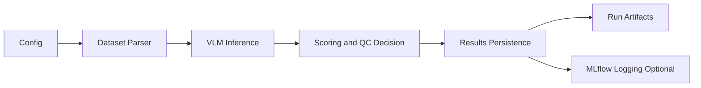
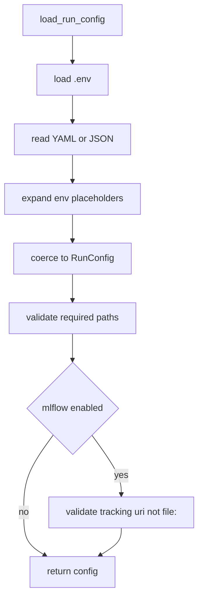
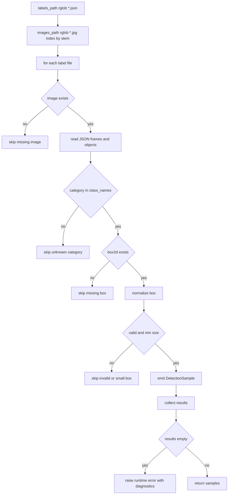
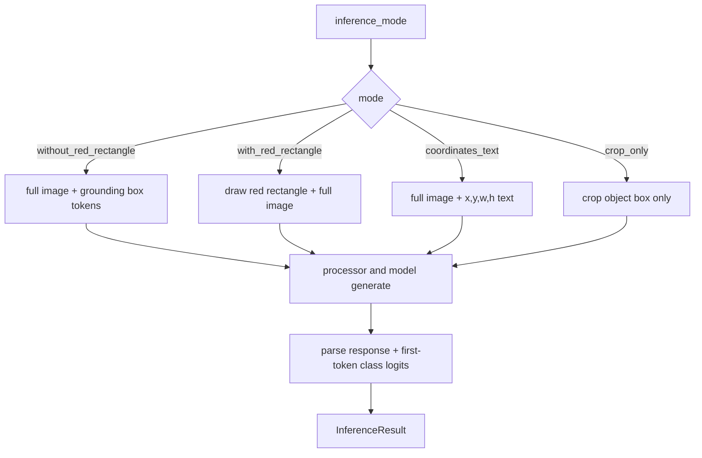
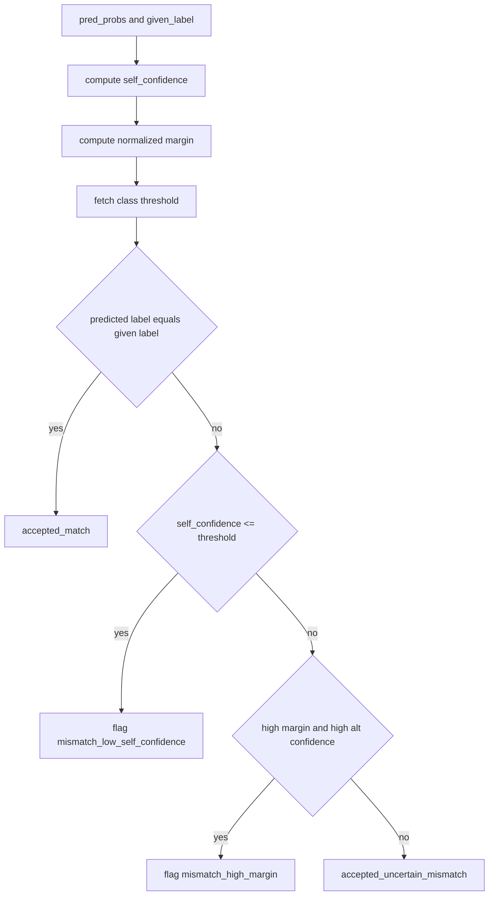
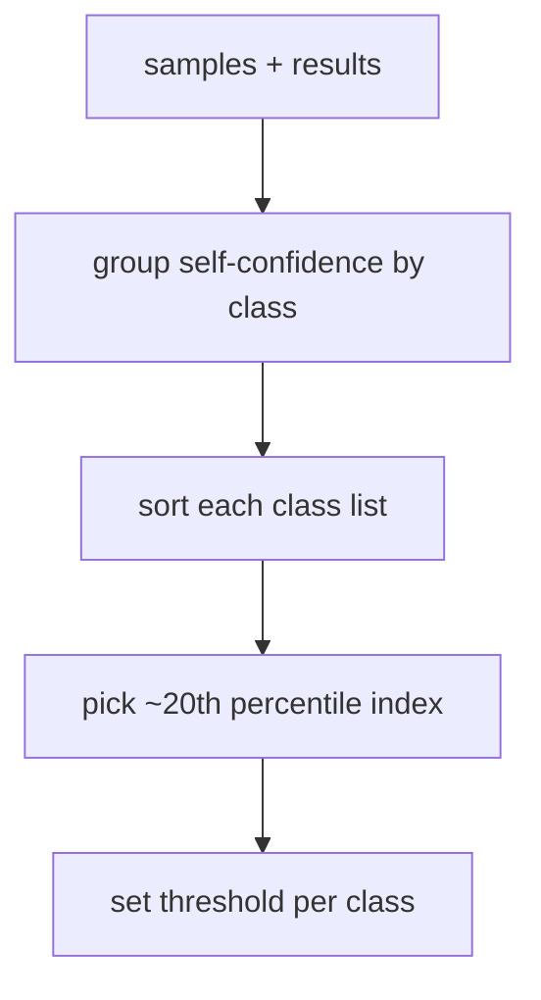
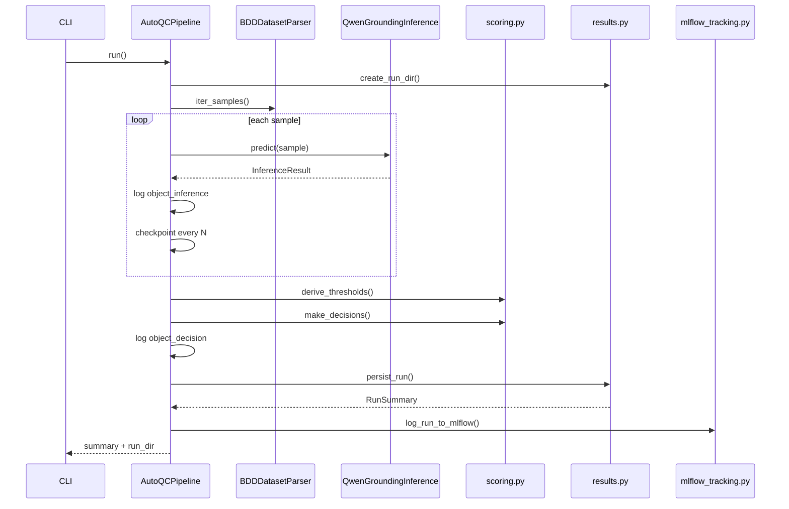
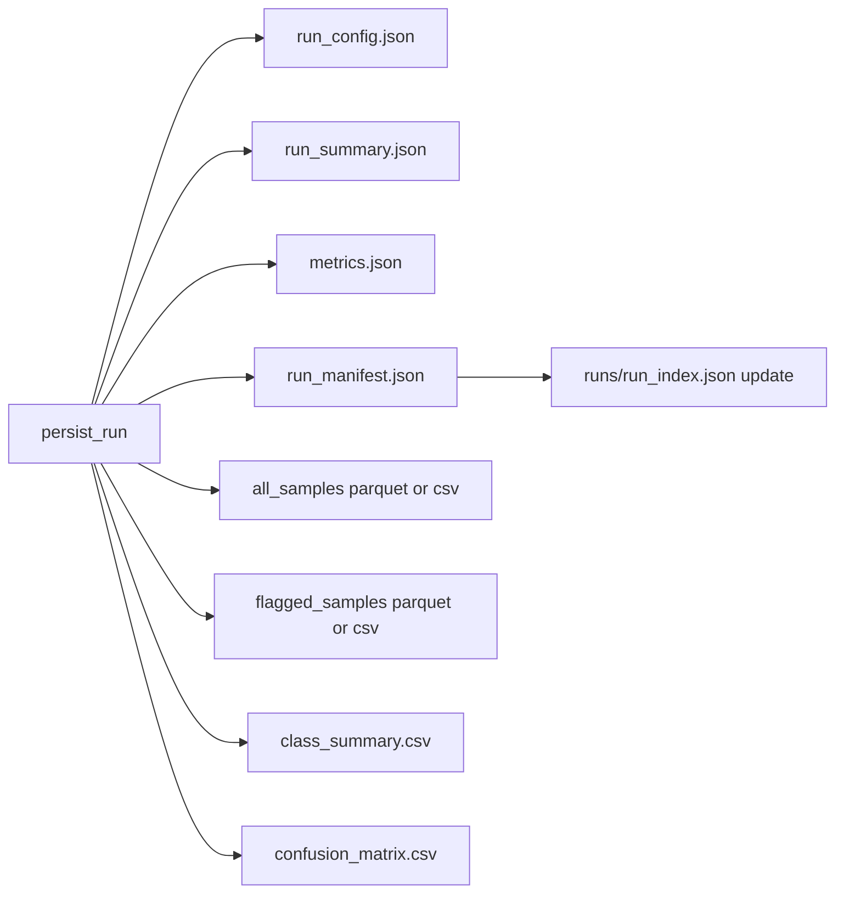
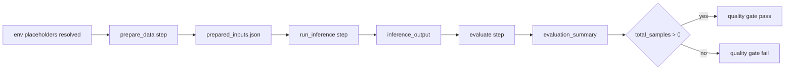
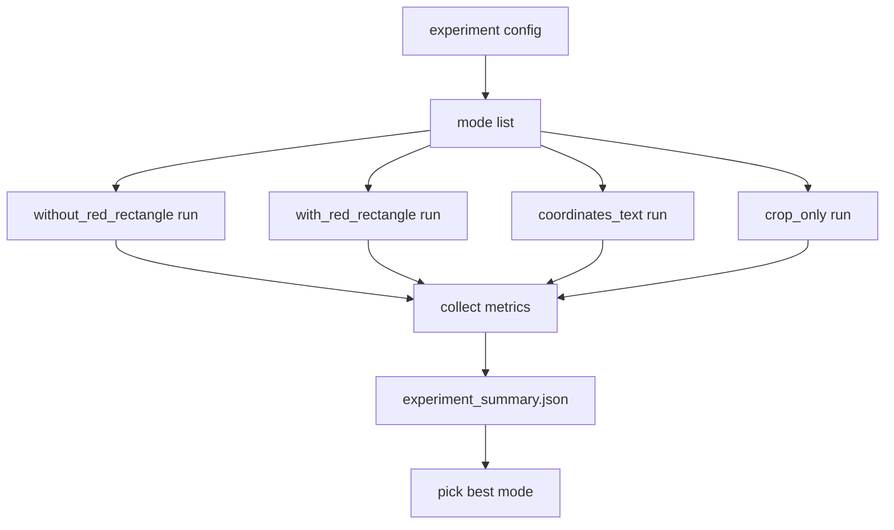

# Mermaid Charts

This page provides section-by-section Mermaid diagrams for the AutoQC system.

## 1) System Overview

## 2) Config Loading and Validation

## 3) Dataset Parsing Flow

## 4) Inference Mode Selection

## 5) Scoring and Decision Logic

## 6) Threshold Derivation

## 7) Pipeline Orchestration

## 8) Run Artifacts and Tracking

## 9) Azure DAG Pipeline

## 10) Experiment Matrix

